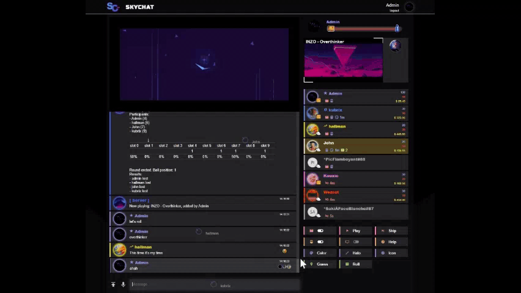

# SkyChat

The **SkyChat** is a modern-looking discussion platform with real-time visualisation of everyone's cursor, and a shared and synchronized youtube player.

It also includes many customisation/entertainment features such as:
- Custom text and halo colors to be bought for user messages
- Virtual money with mini-games (casino roulette, guess the number)
- An XP system with associated ranks, based on users activity
- Custom profile pictures (guests have randomly generated ones)

Most of these features can be enabled-disabled from the configuration file.

Overall, here is what it looks like:

### Synchronized Youtube Player

Users can play any youtube video on a shared and synchronized player. Orchestration is implemented through a public queue of videos to play, and decision-making (for instance to skip videos) is done with polls. Democracy 💯


### Live cursor visualization and mini-games

Users can interact and play with integrated mini-games (which can be disabled in the configuration).
Users can also see each other cursors moving in real time. This gives a sense of proximity between users. This is the most iconic feature of the SkyChat.


### Cinema mode

If watching long videos, documentaries, or tv shows, the cinema-mode allows users to watch the video in full-screen and have the tchat minimized on the bottom-right of the screen.


### And much more

This is not all, but to discover all features, you may as well launch an instance and try it yourself!

## How to install

Ensure you have the following installed on your system:
- sqlite3
- nodejs/npm

Then, follow these steps:

```bash
# 1. Clone the repository
git clone https://github.com/skychatorg/skychat.git
cd skychat

# 2. Install nodejs dependencies
npm i

# 3. Generates the .env.json, stickers.json, config.json files and the database
npm run setup

# 4. Build and run the app
npm run dev
```

### Setup Youtube

The SkyChat requires a key for the Youtube plugin to work. This key needs to be put in your `.env.json` file.

Using the Youtube API is free but there is a daily quota, which when exceeded blocks the requests until the next day. If it happens, the Youtube plugin will be disabled until the next day. 

1. Go to [the Google Cloud Platform](https://console.cloud.google.com/apis/api/youtube.googleapis.com/credentials). If you never activated the account, you will have to activate it. 
2. Click `Create credentials > API key`
3. Copy the generated API key, and paste it in your `.env.json` file (the variable name is `youtube_api_key`)
4. Restart the server


### Setup a super-user

In order to escalate user rights, you can setup a super-user by editing the `.env.json` file and adding one or multiple usernames in the `op` array.

## How to dev

```bash
npm run dev
```

This will start a static file server & websocket server on http://localhost:8080
When the source files change, the build processes runs automatically

## The env.json file

The fields in the .env.json contain private information related to the application.

The semantic of these fields are defined below:


| field                    | type                                      | default                                                           | semantic                                                                                            |
|--------------------------|-------------------------------------------|-------------------------------------------------------------------|-----------------------------------------------------------------------------------------------------|
| location                 | string                                    | "http://localhost:8080"                                           | Server location, i.e. what user need to put in their browser to access your app                     |
| hostname                 | string                                    | "localhost"                                                       | Hostname the server will listen to                                                                  |
| port                     | number                                    | 8080                                                              | Server port                                                                                         |
| ssl                      | false or {certificate:string,key:string}  | false                                                             | SSL configuration (paths to certificate and key files). Use false if SSL is disabled.               |
| **users_passwords_salt** | string                                    | ""                                                                | Password salt. MUST be set manually.                                                                |
| **users_token_salt**     | string                                    | ""                                                                | Token salt. MUST be set manually.                                                                   |
| **youtube_api_key**      | string                                    | ""                                                                | Youtube api key                                                                                     |
| op                       | string[]                                  | []                                                                | OP usernames. OP usernames can use the /setright command.                                           |
| email_transport          | nodemailer.JSONTransport                  | {"sendmail": true,"newline": "unix","path": "/usr/sbin/sendmail"} | Value given to [nodemailer.createTransport](https://nodemailer.com/about/) to initialize the mailer |


## The config.json file

The config.json file specifies application preferences. The available fields are detailed below.

**ranks**

- Type: `Array<{limit: number, images: {'18': string, '26': string}}>`
- Description: Rank definition (xp threshold and image path). Must be sorted by descending limit.
  - limit: XP limit to have this rank. The last rank definition must have `0` as the limit, otherwise new users will not have any rank.
  - images: Image path corresponding to the rank icon for each 18 and 26px sizes. Image paths should be relative to `/assets/images/`.


**plugins**

- Type: `Array<string>`
- Description: Enabled plugins. Must only define classes exported by `app/server/skychat/commands/impl/index.ts`


**fakeMessages**

- Type: `Array<string>`
- Description: Fake raw messages that are displayed to guests and low-rank users when they connect to the skychat. 


**guestNames**

- Type: `Array<string>`
- Description: When a guest logs in, a random name is associated to its session. These names are randomly fetched from this file. If you want to change these names, keep in mind that they should not contain whitespace characters (anything matched by \s so newline, tab, space, ..). Default random names are animal names.
